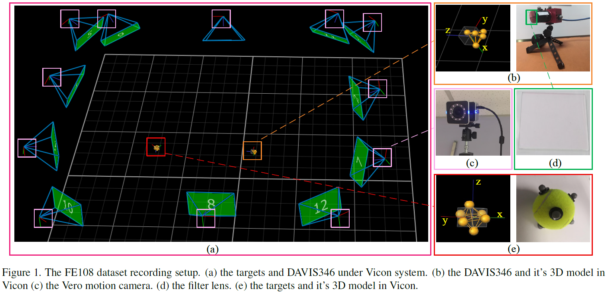

### **About FE108**
 ----------------------------------------------------------------------------------------- 

The FE108 dataset is captured by a DAVIS346 eventbased camera, which equips a 346x260 pixels dynamic vision sensor (DVS) and an active pixel sensor (APS). It
can simultaneously provide events and aligned grayscale images of a scene. The ground truth bounding boxes of a moving target are provided by the Vicon motion capture
system, which captures motion with a high sampling rate (up to 330Hz) and sub-millimeter precision. During the capturing process, we fix APS’s frame rate to 20/40 FPS and
Vicon’s sampling rate to 240Hz, which are also the annotation frequency of the captured APS frame and accumulated events, respectively.
FE108 is featured in 

**> High-quality label**. The Vicon system can provide the 3D position and trajectory of targets in sub-millimeter precision.

**> Diversity in target.** 21 classes, which can be divided into three categories: animal, vehicle, and daily goods (e.g., bottle, box).

**> Real world challenges.** Low light, high dynamic range, fast motion, motion blur and so on.


### **Download**
-----------------------------------------------------------------------------------------

link?

email?


### **How to use FE108**
-----------------------------------------------------------------------------------------
| - - FE108

&nbsp;&nbsp;&nbsp;&nbsp;&nbsp;&nbsp;| - - train.list &nbsp;&nbsp; # train sequences

&nbsp;&nbsp;&nbsp;&nbsp;&nbsp;&nbsp;| - - test.list &nbsp;&nbsp; # test sequences

&nbsp;&nbsp;&nbsp;&nbsp;&nbsp;&nbsp;| - - pair.txt &nbsp;&nbsp; # record start frame in event.aedat4

&nbsp;&nbsp;&nbsp;&nbsp;&nbsp;&nbsp;| - - read_img.py &nbsp;&nbsp; # read and save gray image from event.aedat4

&nbsp;&nbsp;&nbsp;&nbsp;&nbsp;&nbsp;| - - stack_event.py  &nbsp;&nbsp; # stack events and save it

&nbsp;&nbsp;&nbsp;&nbsp;&nbsp;&nbsp;| - - seq1

&nbsp;&nbsp;&nbsp;&nbsp;&nbsp;&nbsp;&nbsp;&nbsp;&nbsp;&nbsp;&nbsp;&nbsp;| - - event.aedat4 &nbsp;&nbsp; # raw data from DAVIS346

&nbsp;&nbsp;&nbsp;&nbsp;&nbsp;&nbsp;&nbsp;&nbsp;&nbsp;&nbsp;&nbsp;&nbsp;| - - groundtruth.txt &nbsp;&nbsp; # xywh

&nbsp;&nbsp;&nbsp;&nbsp;&nbsp;&nbsp;| - - ...

&nbsp;&nbsp;&nbsp;&nbsp;&nbsp;&nbsp;| - - seq2


### **Preview of Sample Videos**
-----------------------------------------------------------------------------------------


### **Reference**
-----------------------------------------------------------------------------------------
Please consider citing FE108 if it is helpful for you :)

 ```python
Object Tracking by Jointly Exploiting Frame and Event Domain 

Jiqing Zhang, Xin Yang, Yingkai Fu, Xiaopeng Wei, Baocai Yin, Bo Dong

IEEE International Conference on Computer Vision (ICCV), July, 2021
 ```
