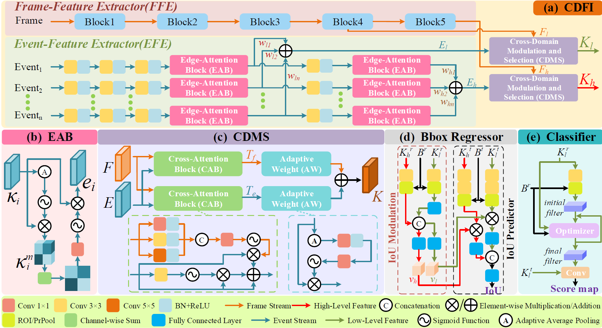
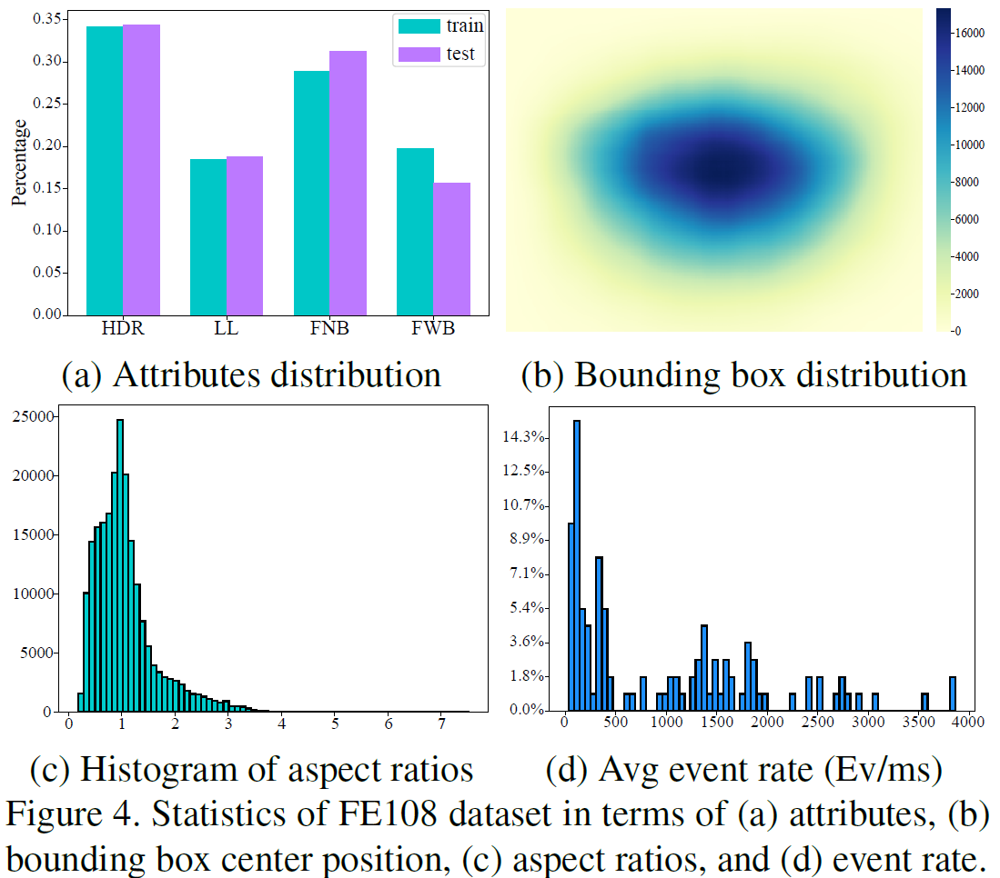
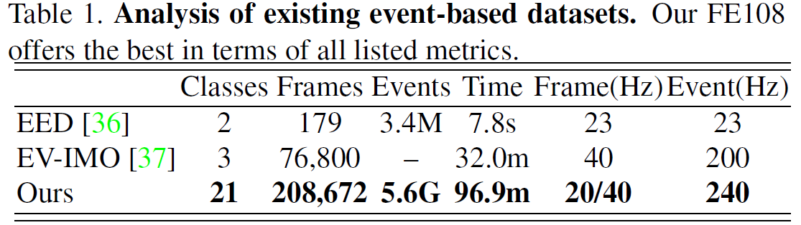
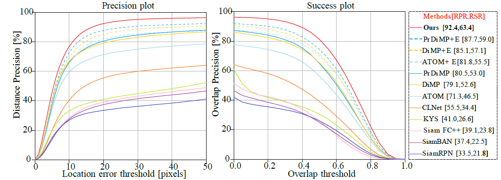
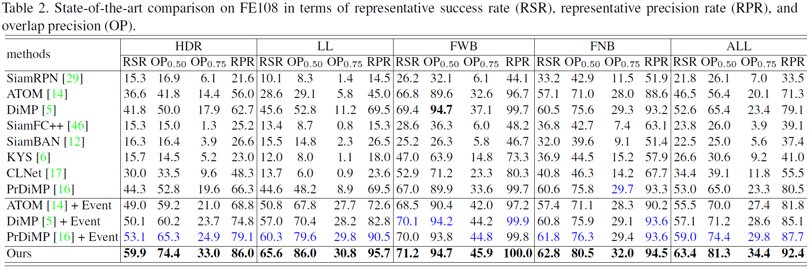
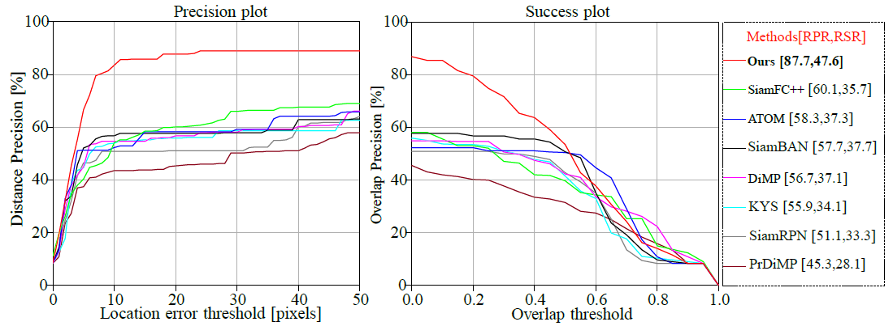
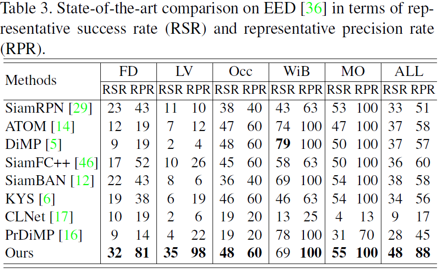
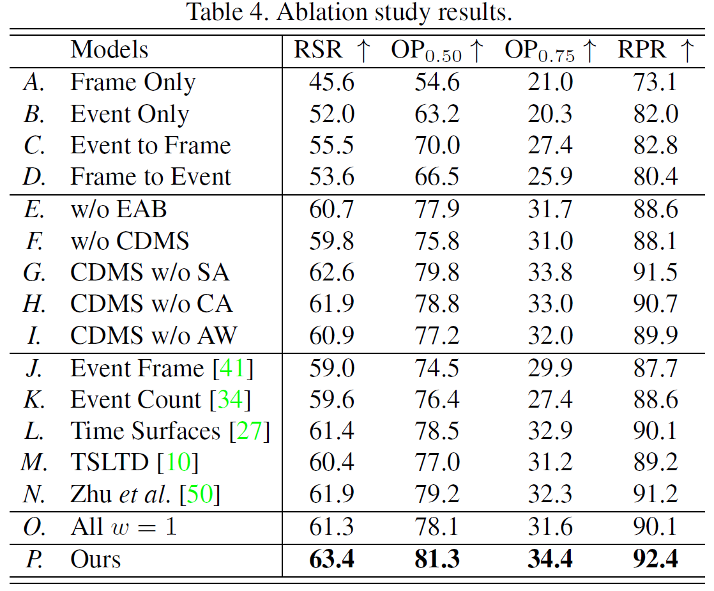

### **Detailed architectures of the proposed components**

### **Statistics of FE108 dataset**

### **Results on FE108 dataset**

### **Results on EED dataset**

### **Ablation studies**

{}
You can also view related project information from Professor [Yang's homepage](https://xinyangdut.github.io/).
{}
