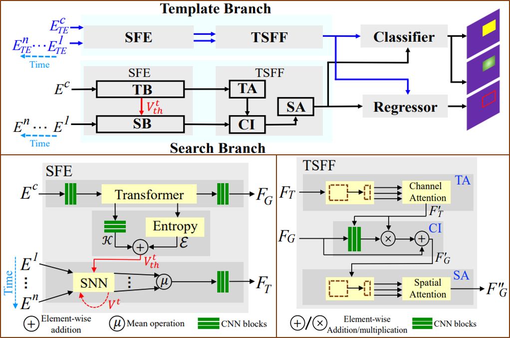
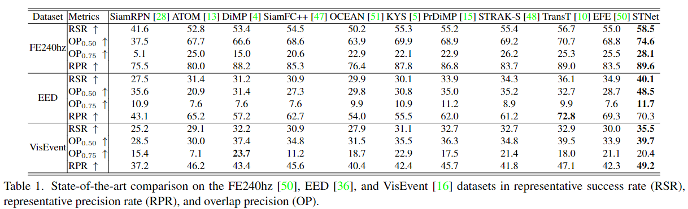
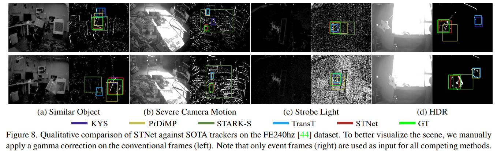

---
publication_types:
  - "1"
authors:
  - Jiqing Zhang
  - Bo Dong
  - Haiwei Zhang
  - Jianchuan Ding
  - Felix Heide
  - Baocai Yin
  - Xin Yang
publication: IEEE Conference on Computer Vision and Pattern Recognition
publication_short: "*CVPR*"
abstract: Event-based cameras bring a unique capability to tracking, being able
  to function in challenging real-world conditions as a direct result of their
  high temporal resolution and high dynamic range. These imagers capture events
  asynchronously that encode rich temporal and spatial information. However,
  effectively extracting this information from events remains an open challenge.
  In this work, we propose a spiking transformer network, STNet, for single
  object tracking. STNet dynamically extracts and fuses information from both
  temporal and spatial domains. In particular, the proposed architecture
  features a transformer module to provide global spatial information and a
  spiking neural network (SNN) module for extracting temporal cues. The spiking
  threshold of the SNN module is dynamically adjusted based on the statistical
  cues of the spatial information, which we find essential in providing robust
  SNN features. We fuse both feature branches dynamically with a novel
  cross-domain attention fusion algorithm. Extensive experiments on two
  event-based datasets, FE240hz and EED, validate that the proposed STNet
  outperforms existing state-of-the-art methods in both tracking accuracy and
  speed with a significant margin.
draft: false
url_pdf: https://openaccess.thecvf.com/content/CVPR2022/papers/Zhang_Spiking_Transformers_for_Event-Based_Single_Object_Tracking_CVPR_2022_paper.pdf
url_dataset: null
url_video: https://youtu.be/iRkgBy0V1Dk
title: Spiking Transformers for Event-based Single Object Tracking （CVPR 2022）
featured: false
date: 2022-03-02T01:41:08.235Z
url_supp: https://openaccess.thecvf.com/content/CVPR2022/supplemental/Zhang_Spiking_Transformers_for_CVPR_2022_supplemental.pdf
image:
  filename: featured.jpg
  focal_point: Smart
  preview_only: false
url_code: https://github.com/Jee-King/CVPR2022_STNet
---

### **Overview of the proposed STNet**

### **Results on different test dataset**

### **Qualitative comparison**

