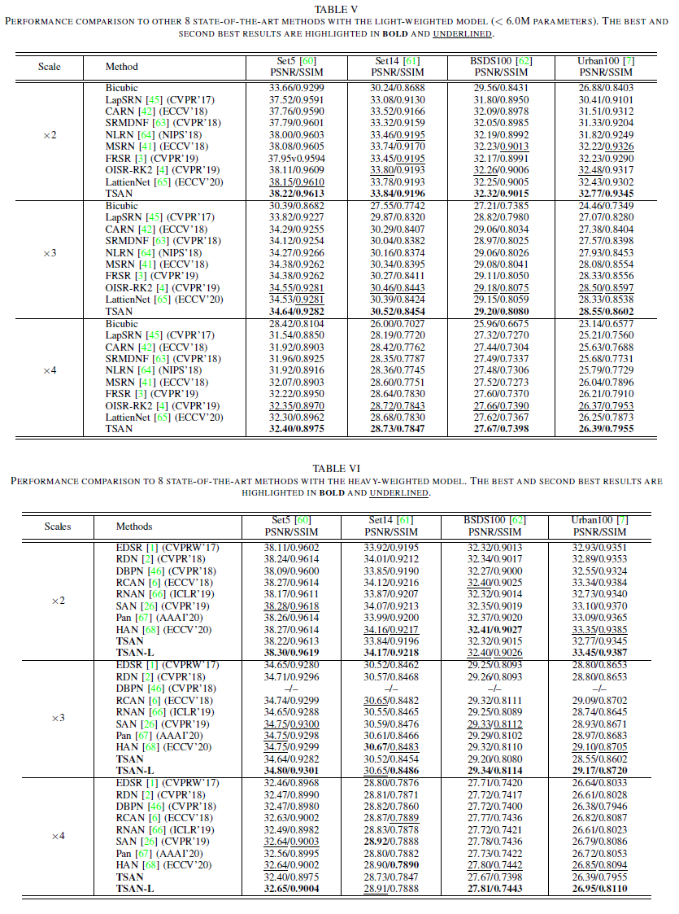
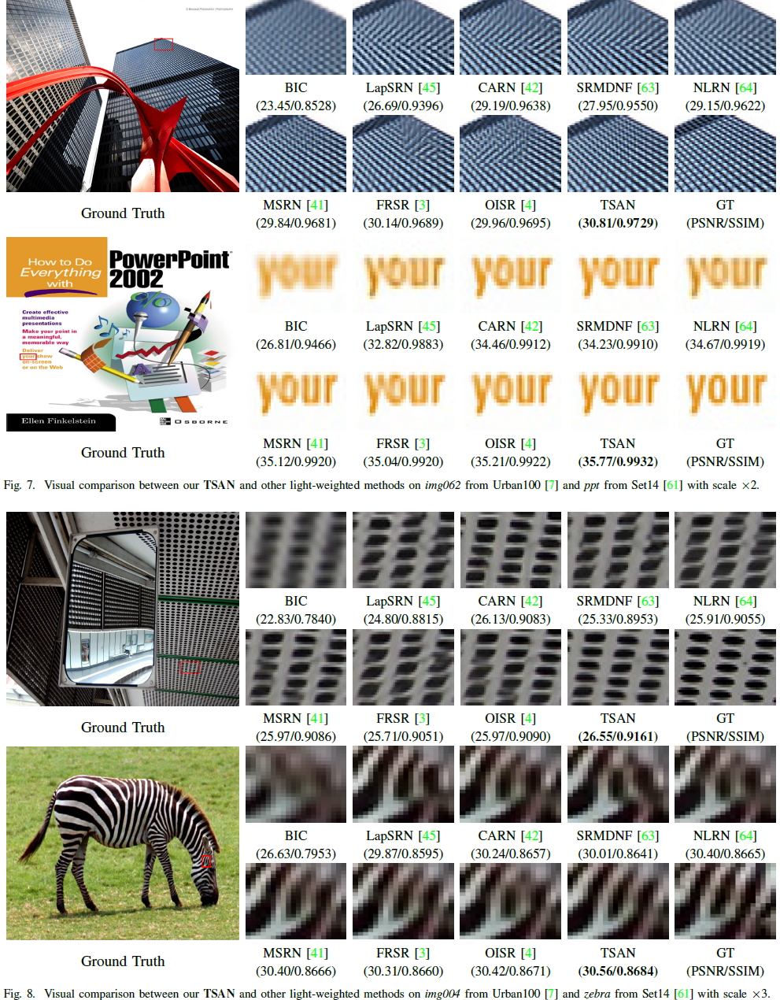
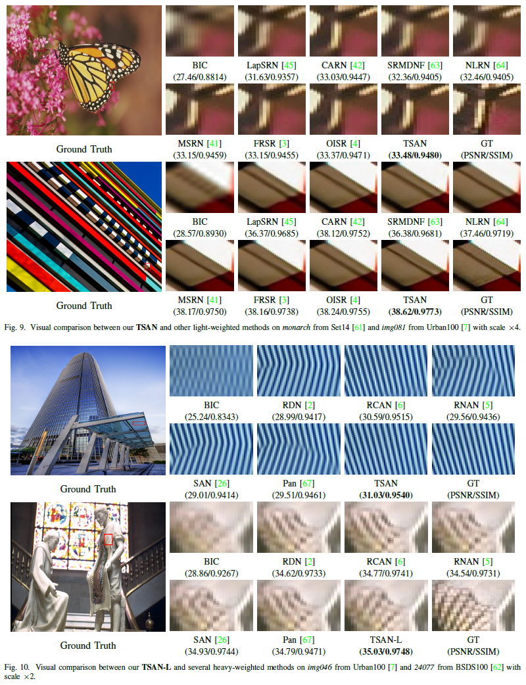
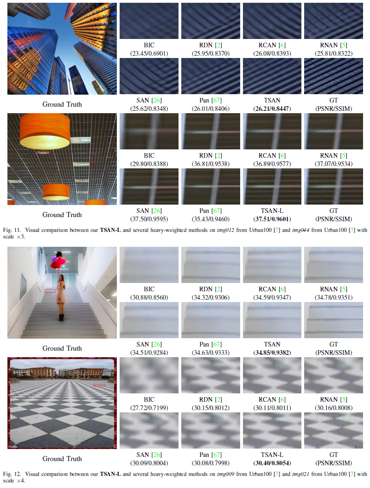

### Comparison with SOTA Methods

### Visual Results

{}
Click the *Cite* button above to demo the feature to enable visitors to import publication metadata into their reference management software.
{}

{}
Create your slides in Markdown - click the *Slides* button to check out the example.
{}

Supplementary notes can be added here, including code, math, and images.
